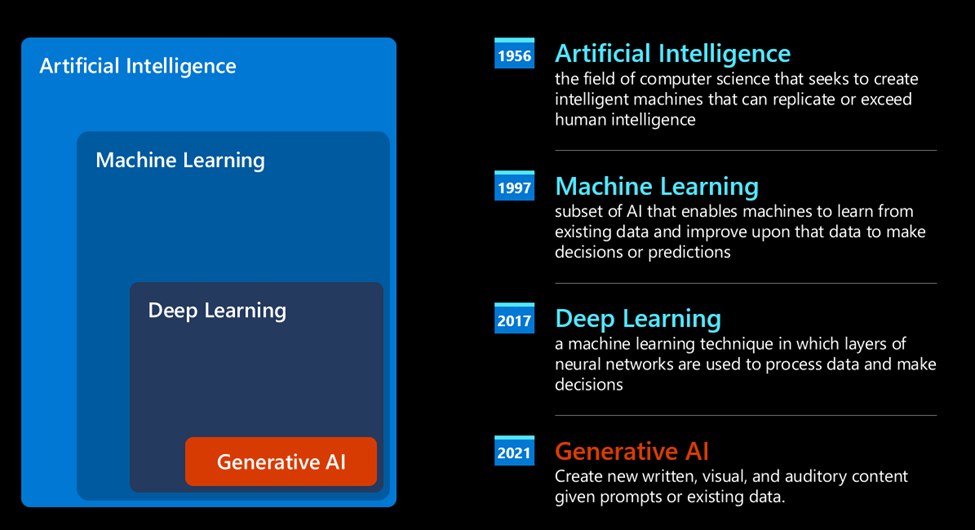

# 01 生成式人工智能

尽管最近因生成人工智能模型的发布而引起了对人工智能技术的“炒作”，但人工智能已经有数十年的历史，最早的研究工作可以追溯到上世纪 60 年代。 我们现在正处于 AI 具有人类认知能力的阶段，例如 [OpenAI ChatGPT](https://openai.com/chatgpt?WT.mc_id=academic-105485-koreyst) 或 [Bing Chat](https://www.microsoft.com/edge/features/bing-chat?WT.mc_id=academic-105485-koreyst) 也在用 GPT 模型进行对话。

稍微回顾一下，人工智能的第一个原型是打字的聊天机器人，依赖于从一组专家系统中提取到计算机中的知识库。 知识库中的答案是由输入文本中出现的关键字触发的。 然而，很快大家就发现，这种使用打字聊天机器人的方法并不能很好地扩展。

## 历史

### 人工智能的统计学：机器学习

随着统计学在文本分析中的应用，20 世纪 90 年代出现了一个转折点。 这导致了新算法的发展——被称为机器学习——能够从数据中学习的模式，不需要使用显式编程。 这种方法允许机器模拟人类语言理解：在文本标签配对上训练统计模型，使模型能够使用代表消息意图的预定义标签对未知输入文本进行分类。

### 神经网络和现代虚拟助手的出现

近年来，硬件技术的发展能够处理更大量的数据和更复杂的计算，让人工智能领域的研究得以加速，从而导致了更先进的机器学习算法（称为神经网络或深度学习算法）的发展。

神经网络（特别是循环神经网络 - RNN）显着增强了自然语言处理领域的应用，能够以更有意义的方式表示文本含义，并重视句子中单词的上下文之间的联系。

这项技术为新世纪第一个十年诞生的虚拟助手提供了动力，它们非常精通解释人类语言、识别需求并执行满足需求的操作，例如使用预定义的脚本进行回答或使用第三方服务。

### 今天 - 生成式人工智能的诞生

这就是我们今天提出生成式人工智能的原因，它可以被视为深度学习的一个子集。

经过人工智能领域数十年的研究，一种名为 *Transformer* 的新模型架构克服了 RNN 的限制，能够获得更长的文本序列作为输入。 Transformer 基于注意力机制，使模型能够为其接收到的输入赋予不同的权重，“更加专注于”关联信息集中的地方，不管它们在文本序列中的顺序如何。

生成式人工智能模也称为 LLM，因为它们使用文本输入和输出的架构。 这些模型的有趣之处在于，它们经过来自书籍、文章和网站等不同来源的大量未标记数据的训练，可以适应各种各样的任务，并以创造性的方式生成语法正确的文本。 因此，它们不仅极大地增强了机器“理解”输入文本的能力，而且使机器能够以人类语言生成原始响应。

## 补充

- [ ] https://en.wikipedia.org/wiki/Generative_artificial_intelligence
